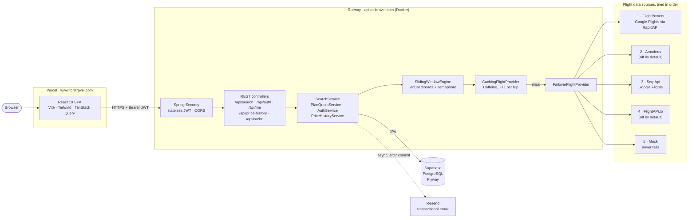
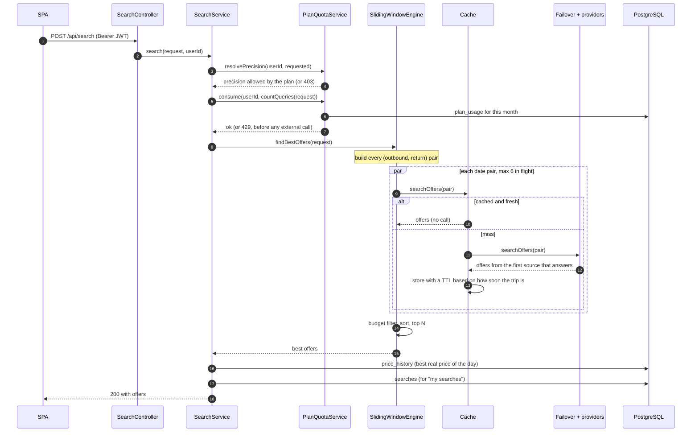
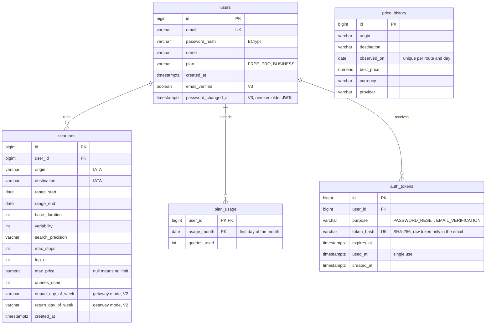

# Torii

[](https://github.com/marcos-ruizflores/Torii/actions/workflows/ci.yml)


Flight deal finder for people with flexible dates. Instead of searching one fixed
outbound and return day, you tell Torii a holiday window, how long you want to stay and
how much that can stretch, and it scans every date combination in that window and
returns the cheapest round trips, with Google's verdict on whether the price is low,
typical or high for that route when the data source provides it.

**Live:** [www.toriitravel.com](https://www.toriitravel.com) (the UI is in Spanish).

> "Barcelona to Tokyo, any time between July and September, 14 to 17 days."
> That's 306 possible trips. Torii checks them in parallel, caches every answer and
> gives you the top 5.

## Contents

- [Architecture](#architecture)
- [What happens during a search](#what-happens-during-a-search)
- [The search algorithm](#the-search-algorithm)
- [Keeping API calls down](#keeping-api-calls-down)
- [Plans and quotas](#plans-and-quotas)
- [Data model](#data-model)
- [Authentication and emails](#authentication-and-emails)
- [Tech stack](#tech-stack)
- [Project structure](#project-structure)
- [Running locally](#running-locally)
- [Tests, CI and deployment](#tests-ci-and-deployment)
- [API](#api)
- [Roadmap](#roadmap)

## Architecture



It's a modular monolith: one Spring Boot service, split by package (`algorithm`,
`provider`, `search`, `user`, `auth`, `history`, `email`). The SPA and the API live on
different origins and talk over JSON, with CORS allowed only for the production
domains.

The piece that holds it together is the `FlightProvider` interface:

```java
List<FlightOffer> searchOffers(String origin, String destination,
                               LocalDate departDate, LocalDate returnDate, int maxStops);
```

The search engine only ever sees one `FlightProvider`. What it actually gets is a stack
of them built in `ProviderConfig`:

```
SlidingWindowEngine -> Cache( Failover( [FlightPowers, Amadeus, SerpApi, FlightAPI, Mock] ) )
```

The cache is a decorator, the failover is a provider made of providers, and each real
source is one class that maps its API to `FlightOffer`. Adding a source is one class
plus one `if` in the config, and the algorithm doesn't change.

## What happens during a search



A few rules worth calling out:

- **Quota is charged before any work.** The exact number of lookups is known up front
  (it's pure date arithmetic), so a search that doesn't fit in the remaining quota is
  rejected with a `429` without spending a single API call.
- **The plan decides the precision.** Asking for a precision the plan doesn't include
  gives a `403`; not asking for one runs the finest one the plan has.
- **History writes are best effort.** If the database hiccups after the search ran,
  the user still gets their results. The quota check is not best effort.
- **One failing date doesn't kill the search.** If every provider fails for one pair,
  that pair is logged and skipped, and the rest of the results still come back.

## The search algorithm

### The problem

A request looks like this:

| Field | Example | Meaning |
|---|---|---|
| `rangeStart`, `rangeEnd` | 2026-07-01 to 2026-09-30 | The holiday window. You have to leave and be back inside it. |
| `baseDuration` | 14 | Shortest stay, in days. |
| `variability` | 3 | Extra days the stay can stretch, so 14, 15, 16 or 17. |
| `precision` | `FAST` | How many days the departure date jumps on each step. |
| `maxStops`, `topN`, `maxPrice` | 1, 5, 600 | Filters and how many results to return. |

Flight APIs answer one question: the price for *this* outbound day and *this* return
day. So the job is to turn the request into the list of (outbound, return) pairs worth
asking about, ask about all of them as cheaply as possible, and keep the best ones.

### Generating the date pairs

`SlidingWindowEngine.buildDatePairs` slides a window of each possible length across the
range:

```java
for (int duration = minDuration; duration <= maxDuration; duration++) {
    LocalDate lastValidDeparture = rangeEnd.minusDays(duration);
    for (LocalDate depart = rangeStart; !depart.isAfter(lastValidDeparture); depart = depart.plusDays(step)) {
        pairs.add(new DatePair(depart, depart.plusDays(duration)));
    }
}
```

```
range:      Jul 1 ............................................. Sep 30
14 days:    [Jul 1 ── Jul 15]
               [Jul 4 ── Jul 18]              step = 3 (FAST)
                  [Jul 7 ── Jul 21]
                     ...                [Sep 14 ── Sep 28]
15 days:    [Jul 1 ─── Jul 16]
               ...
17 days:    ...                        [Sep 11 ───── Sep 28]
```

With `R` the number of days between `rangeStart` and `rangeEnd` and `s` the step, the
number of lookups is:

```
lookups = Σ  ( ⌊(R − d) / s⌋ + 1 )     for d = minDuration .. maxDuration
```

It's `O(R × V / s)` pairs, where `V` is the number of lengths explored. Generating them
is trivial; each one is a network call, which is what the rest of the design is about.
The same function (`countQueries`) is used to charge the quota, and the form in the
frontend runs the same formula to show the cost live before you hit search.

### Precision: coverage vs. cost

| Precision | Step | BCN → NRT, Jul 1 – Sep 30, 14–17 days |
|---|---|---|
| `EXHAUSTIVE` | every day | 306 lookups |
| `BALANCED` | every 2 days | 154 lookups |
| `FAST` | every 3 days | 103 lookups |

Skipping days can miss the exact cheapest departure, but prices on neighbouring days
tend to move together. In the recorded examples in [`examples/`](examples/README.md),
the FAST run found a fare of 326 EUR against 325 EUR for the exhaustive one, with a
third of the calls.

A search that fits the free plan (30 lookups a month): Barcelona to Lisbon, October 1–31,
4 or 5 days, FAST. `R = 30`, so `⌊26/3⌋ + 1 = 9` pairs for 4 days plus
`⌊25/3⌋ + 1 = 9` for 5 days, 18 lookups in total. The same search at EXHAUSTIVE would
need 53.

### Getaway mode

If the request has `departDayOfWeek` and `returnDayOfWeek` (for example Friday to
Sunday), the window stops sliding day by day. `WeekPattern` fixes the length of stay
(Friday to Sunday is 2 days; the same day twice means a full week) and the engine jumps
week by week from the first matching weekday:

```
Oct 2 (Fri) → Oct 4 (Sun)
Oct 9 (Fri) → Oct 11 (Sun)
...
Dec 18 (Fri) → Dec 20 (Sun)
```

Every weekend from October 1 to December 20 is 12 lookups. Precision plays no part
here because the step is always 7 days.

### Running the lookups

The pairs are independent and each one is mostly waiting on the network, so they run
on Java 21 **virtual threads**, one per pair, with a `Semaphore` capping how many are
in flight at once (`torii.search.max-concurrency`, 6 by default) so we stay under the
providers' rate limits. Total time goes from the sum of all calls to roughly the number
of batches times one call.

Once everything is back:

1. **Budget filter.** `maxPrice` is applied here, on the collected offers, and never
   sent to the APIs. That keeps the cache key independent of the budget, so the same
   cached pairs serve any `maxPrice`.
2. **Sort** by price, then departure date, then airline. The tie-breakers matter:
   results come back in whatever order the threads finish, and without them two offers
   with the same price could swap places between identical searches.
3. **Top N.**

## Keeping API calls down

Every lookup against a real source costs money or free-tier quota, so there are three
layers between the engine and the network.

### A cache per date pair

`CachingFlightProvider` wraps the whole failover chain in a Caffeine cache keyed by
`(origin, destination, departDate, returnDate, maxStops)`. The key is the single date
pair, not the whole search, so two overlapping searches share most of their lookups: a
July–September search and a July–August one for the same route reuse every pair they
have in common.

How long an entry lives depends on how soon the trip is, since a flight six months away
barely moves day to day and one leaving tomorrow can change within hours
(`TripTtlPolicy`, all thresholds configurable):

| Departure in | TTL |
|---|---|
| more than 60 days | 7 days |
| 14 to 60 days | 24 hours |
| 2 to 13 days | 1 hour |
| less than 2 days | 10 minutes |

The TTL is set on creation and never extended by reads, so popular entries still get
refreshed. Lookups go through Caffeine's atomic `get(key, loader)`, which means two
threads asking for the same pair at the same moment trigger one real call, not two.
Hit and miss counts are exposed on `GET /api/cache/stats`.

### Failover between sources

`FailoverFlightProvider` tries the configured sources in order and returns the first
answer:

- A source that says it's **out of quota** (`ProviderQuotaExceededException`, from a
  429 or a RapidAPI 403) gets parked for 5 minutes. The parked state is shared, so the
  rest of the search, and other users' searches, skip it straight away instead of
  hitting it hundreds of times.
- A **temporary failure** (`FlightProviderException`) just moves on to the next source
  without parking. FlightPowers also treats a `X-Search-Status: degraded` response as a
  failure, because Google cut that search short and it may not include the cheapest
  fare.
- The **mock provider** goes last and never fails, so the app always answers even with
  no keys configured. Its offers are excluded from the price history so they never
  pollute real data.

FlightPowers goes first because it's the cheapest source per call. Its responses have
fields for Google's price insight (`low` / `typical` / `high` plus the usual price
range), which feed the "Veredicto" column, but in practice only one-way searches fill
them: round-trip responses come back with them empty. So Torii works out its own
(`PriceVerdictService`): it compares each offer with the best daily prices it has
stored for the route over the last 90 days (at least 5 days, today excluded), or, while
a route has less history than that, with the cheapest price of each date scanned in
the same search (at least 6). The usual range is the 25th to 75th percentile; at or
below it is low, at or above it is high. The UI always says which of the two the
verdict is based on, and with less data than that it shows no verdict instead of
guessing.

### A second look at the cheapest dates

FlightPowers only returns the fares Google Flights highlights ("Mejores opciones"),
not the ones it files under "Otros vuelos", which are sometimes cheaper (BCN–NRT,
1–14 Dec 2026: 729 EUR from FlightPowers, 575 EUR on Google). SerpApi does return
those, but its quota is too small to scan every date. So once the scan is done,
`BestDatesRefiner` asks SerpApi again for the 3 cheapest date pairs only, merges the
results without duplicates and re-ranks them. That's 3 calls per search, cached like
the rest, best effort (on a quota error it pauses for an hour) and off with
`torii.search.refine.enabled=false` if FlightPowers ever returns every fare.

### Quotas checked up front

See the next section. Because the cost of a search is known before it runs, no search
ever starts that the user can't afford.

## Plans and quotas

| Plan | Lookups per month | Precisions |
|---|---|---|
| FREE | 30 | FAST |
| PRO | 500 | FAST, BALANCED |
| BUSINESS | unlimited | FAST, BALANCED, EXHAUSTIVE |

Searching requires an account, and one search spends as many lookups as it has date
pairs. Usage is counted per user and calendar month in `plan_usage`. Payments aren't
live yet, so every account is on FREE and self-service plan changes are switched off
(`torii.plans.self-service-changes=false`, `POST /api/me/plan` returns `403`).

## Data model

The schema is owned by Flyway (`src/main/resources/db/migration`) and Hibernate only
validates it (`ddl-auto=validate`).



- `searches` keeps every parameter, including the getaway weekdays added in V2, so a
  past search can be repeated exactly from "Mis búsquedas".
- `price_history` fills itself: each search records the best real price it saw for the
  route that day, and only replaces it if a later search finds something cheaper. The
  price chart in the UI is built from it at no extra API cost.
- `plan_usage` has a composite key `(user_id, usage_month)`, one row per user and month.
- `auth_tokens` backs the emailed links (V3). Only a hash of each token is stored, so
  a leaked table doesn't hand out working links.

## Authentication and emails

- Sign up and log in return a **JWT signed with HS256** (24 hour lifetime). The backend
  keeps no sessions: Spring Security's resource server checks the signature and expiry
  on each request, and the token subject is the user id.
- Passwords are stored only as **BCrypt** hashes.
- `POST /api/search` and everything under `/api/me/**` need a token; price history and
  cache stats are public.
- **Password reset.** `POST /api/auth/password/forgot` always answers 202, so it
  can't be used to find out who has an account. If the email exists, a single-use link
  valid for 30 minutes goes out. Redeeming it sets the new password, logs the user in
  and closes every other session: each JWT carries a `pwc` claim with the password
  version it was issued for, and the decoder rejects it once the password changes.
- **Email verification.** The welcome email carries a 48 hour confirmation link;
  unverified users see a notice with a "resend" button. It doesn't block searching,
  it's there so the account can be recovered.
- Links are 32 random bytes, stored as SHA-256, burned when a new one is issued, and
  limited to one per minute per user.
- Emails go out through Resend from a `@TransactionalEventListener(AFTER_COMMIT)` plus
  `@Async` listener: only once the change is committed, and never slowing down the
  request (which also keeps "forgot password" timing the same for known and unknown
  emails). User input is HTML escaped in the templates and every email has a plain
  text version. With email disabled or no API key, a logging implementation takes its
  place.

## Tech stack

| | |
|---|---|
| Backend | Java 21, Spring Boot 4, Spring Security (OAuth2 resource server, JWT), Spring Data JPA, Flyway, Caffeine |
| Database | PostgreSQL on Supabase; H2 in PostgreSQL mode for tests |
| Frontend | React 19, TypeScript, Vite, Tailwind CSS v4, React Aria / Untitled UI, TanStack Query, Recharts, d3-geo |
| Integrations | FlightPowers (RapidAPI), SerpApi, Amadeus, FlightAPI.io, Resend |
| Infra | Docker multi-stage build on Railway, Vercel for the SPA, Cloudflare DNS, GitHub Actions |
| Testing | JUnit 5, AssertJ, MockRestServiceServer, Spring Boot test slices, Spring Security Test |

## Project structure

```
src/main/java/com/torii
├── algorithm/   SlidingWindowEngine: date pairs, parallel lookups, ranking
├── provider/    FlightProvider interface, cache, failover, mock
│   ├── flightpowers/  serpapi/  amadeus/  flightapi/   one adapter per source
├── cache/       TripTtlPolicy (TTL by days until departure)
├── search/      SearchService, the orchestrator
├── user/        accounts, plans, monthly quota
├── auth/        sign up, log in, JWT, password reset, email verification, /api/me
├── history/     price history and saved searches
├── email/       Resend client, account emails (welcome, reset, verification)
├── api/         search and cache controllers, request DTO and validation
├── config/      typed properties, provider wiring, CORS
└── model/       SearchRequest, FlightOffer, PriceInsight, WeekPattern, SearchPrecision

src/main/resources/db/migration   Flyway migrations
frontend/                         React SPA (see frontend/README.md)
examples/                         real request and response JSON for /api/search
```

## Running locally

Requirements: JDK 21 and Node 24 (`frontend/.nvmrc`).

```bash
# Backend on http://localhost:8080
export SUPABASE_DB_URL=jdbc:postgresql://localhost:5432/torii   # any PostgreSQL works
export SUPABASE_DB_USER=postgres
export SUPABASE_DB_PASSWORD=...
./mvnw spring-boot:run

# Frontend on http://localhost:5173 (proxies /api to :8080)
cd frontend
npm ci
npm run dev
```

Flyway creates the schema on first start. With no provider keys at all, searches are
answered by the mock provider, which is enough to click through the whole app.

| Variable | Needed | What it's for |
|---|---|---|
| `SUPABASE_DB_URL`, `SUPABASE_DB_USER`, `SUPABASE_DB_PASSWORD` | yes | PostgreSQL connection |
| `TORII_JWT_SECRET` | in production | Secret used to sign tokens (there's a dev default) |
| `TORII_CORS_ALLOWED_ORIGINS` | in production | Comma separated origins allowed to call the API |
| `FLIGHTPOWERS_API_KEY` | no | RapidAPI key for FlightPowers; skipped when empty |
| `SERPAPI_KEY` | no | SerpApi key |
| `AMADEUS_API_KEY`, `AMADEUS_API_SECRET` | no | Amadeus, also needs `TORII_AMADEUS_ENABLED=true` |
| `FLIGHTAPI_KEY` | no | FlightAPI.io, also needs `TORII_FLIGHTAPI_ENABLED=true` |
| `RESEND_API_KEY`, `TORII_EMAIL_ENABLED`, `TORII_EMAIL_FROM_ADDRESS` | no | Transactional email |
| `TORII_PLANS_SELF_SERVICE_CHANGES` | no | Lets users change plan from the UI (off until payments exist) |
| `VITE_API_URL` | frontend, production | API base URL baked into the build |

Any other `torii.*` property in `application.properties` can be overridden the same way
through Spring's relaxed binding.

## Tests, CI and deployment

```bash
./mvnw test                          # backend
cd frontend && npm run lint && npm run build
```

The backend tests run fully offline. They use an in-memory H2 database with the real
Flyway migrations applied, so the schema is checked on every run, and every external API
is replaced by `MockRestServiceServer` or a fake provider. They cover the date pair
generation and counts, the getaway mode, cache expiry, failover and parking, each
provider's response mapping and error handling, quotas and precision rules, and the
auth flow end to end.

GitHub Actions ([`ci.yml`](.github/workflows/ci.yml)) runs the backend tests and the
frontend lint and build on every push and pull request.

Deployment is push to `main`: Vercel builds and serves the SPA, and Railway builds the
Docker image and restarts the API. Secrets live only in Railway; the frontend gets
nothing but the public API URL.

## API

| Method | Endpoint | Auth |
|---|---|---|
| POST | `/api/auth/signup`, `/api/auth/login` | no |
| POST | `/api/auth/password/forgot`, `/api/auth/password/reset` | no |
| POST | `/api/auth/email/verify` | no |
| POST | `/api/me/email/verification` (resend link) | JWT |
| POST | `/api/search` | JWT |
| GET | `/api/me`, `/api/me/searches`, `/api/me/usage` | JWT |
| POST | `/api/me/plan` | JWT (disabled until payments) |
| GET | `/api/price-history?origin=&destination=&days=` | no |
| GET | `/api/cache/stats` | no |

Request and response examples are in [`examples/`](examples/README.md).

## Roadmap

- Price alerts: save a search and get an email when it drops or Google flags it as low
- Torii's own price verdict from its history, for offers that come without Google's
- A price calendar endpoint to turn hundreds of lookups into a single call
- Payments for the paid plans
