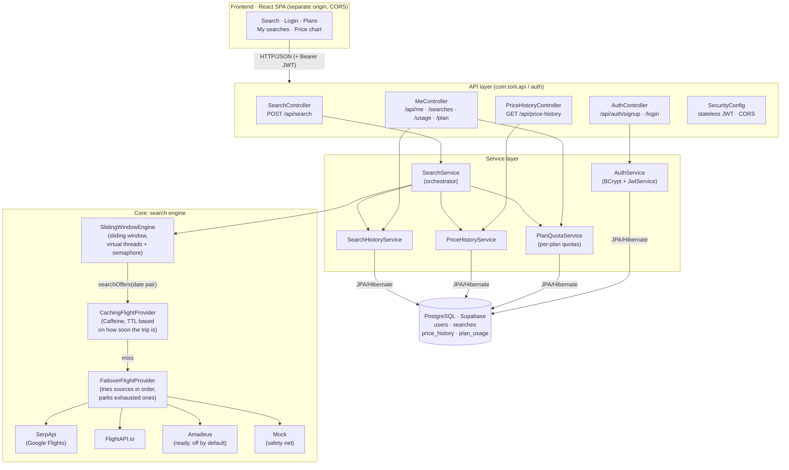
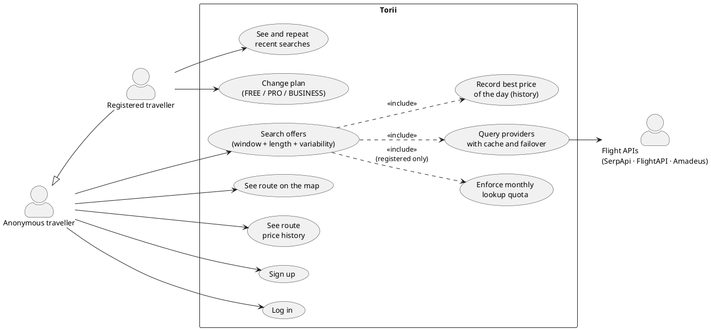
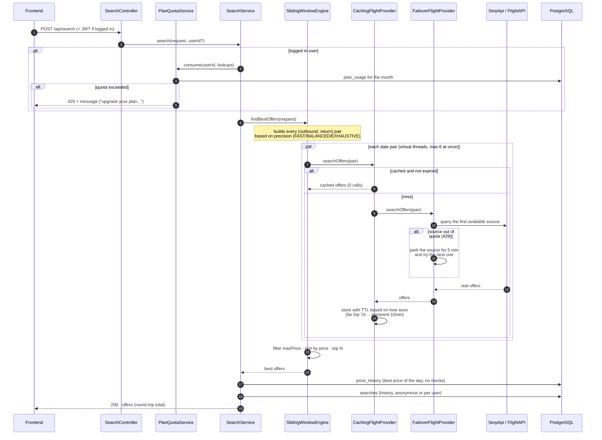
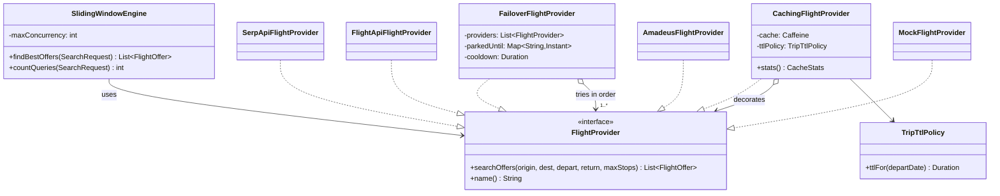
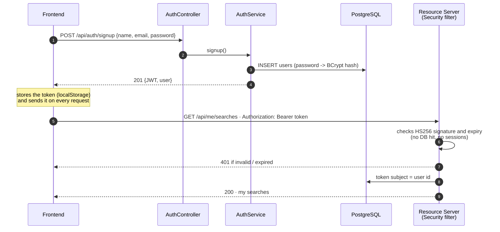
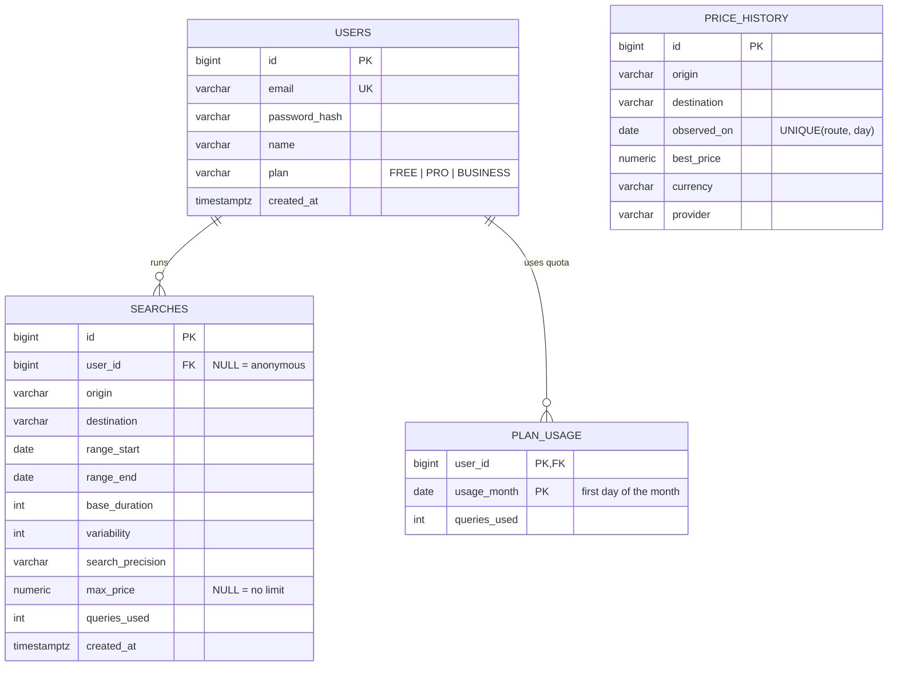

# Torii architecture

> **Phase 0 done**: flight deal search over several data sources, smart caching, users
> with plans and quotas, and a persistent price history.
>
> Mermaid diagrams render directly on GitHub. The use case diagram is PlantUML (paste it
> into [plantuml.com](https://www.plantuml.com/plantuml) or
> [planttext.com](https://www.planttext.com)).

## 1. What Torii does

Users don't search for a flight on fixed dates. They give a **holiday window** (e.g.
July to September), a **base trip length** (e.g. 14 days) and a **variability** (e.g. +3,
so stays from 14 to 17 days). Torii goes through every date combination with a
**sliding window algorithm** and returns the top N cheapest offers (total round-trip
price).

The core design problem: every date combination is a call to a paid API with a limited
quota. The whole architecture is built around **making as few of those calls as
possible and protecting them**: a cache with variable TTL, failover between providers,
search precision levels and per-plan quotas.

**Stack:** Java 21 + Spring Boot 4 (REST API) · PostgreSQL on Supabase (Flyway + JPA) ·
Spring Security + JWT · React + TypeScript + Tailwind/Untitled UI (separate SPA).

## 2. Components



The key point: the engine **doesn't know where the data comes from**. `SlidingWindowEngine`
talks to the `FlightProvider` interface, and the cache, the failover and the real sources
are stacked behind it without the algorithm changing a single line.

## 3. Use cases (PlantUML)



## 4. What happens during a search



Details that matter:

- **Parallelism with virtual threads**: date pairs are queried in parallel (Java 21
  virtual threads) with a global semaphore (`torii.search.max-concurrency`) so we don't
  blow through the APIs' rate limits. The final order is deterministic (price, then date,
  then airline) even though responses come back in any order.
- **Quota is charged BEFORE doing any work**: with no balance left the search is rejected
  without a single external call.
- **DB writes are best effort**: if the DB goes down the search still answers (try/catch
  in the orchestrator). The quota check is NOT best effort, it's a business rule.
- **maxPrice is filtered inside the engine** and never sent to the APIs, so the cache
  works for any budget.

## 5. Engine class diagram (Decorator + Composite)



How it's actually wired (in `ProviderConfig`):

```
Engine -> Cache( Failover( [SerpApi, FlightAPI, Amadeus*, Mock] ) )
```

- **Decorator**: `CachingFlightProvider` wraps another provider and adds caching without
  anyone else knowing. The cache works per *date pair*, so overlapping searches reuse
  hundreds of pairs.
- **Composite/Chain**: `FailoverFlightProvider` is a provider made of providers. It tries
  them in order, and when a source runs out of quota (`ProviderQuotaExceededException`)
  it parks it for a cooldown and moves on. The Mock always goes last: it never fails, so
  the app always answers.
- **Adding a new source = one class + one bean.** No changes to the algorithm.

## 6. Authentication (stateless JWT)



- Passwords: only the **BCrypt hash** is stored (slow, salted, one way).
- The token is **stateless**: the backend keeps no sessions, the signature (secret
  `TORII_JWT_SECRET`) is the only source of truth. Tokens expire after 24h.
- Searching is **public**: with a token the search is linked to the user, without one
  it's anonymous. Only `/api/me/**` requires authentication.

## 7. Data model



- The schema is driven by **Flyway migrations** versioned in git (`db/migration`).
  Hibernate only validates (`ddl-auto=validate`). Tests run the same migrations on
  in-memory H2, offline and against the real schema.
- `price_history` **fills itself**: every real search records (or improves) the best
  price of the day for its route, so the frontend chart grows for free as people use it.
  Mock offers are excluded so they don't pollute real data.

## 8. Business rules: plans and quotas

| Plan | Lookups/month | Note |
|---|---|---|
| FREE | 30 | every account starts here |
| PRO | 500 | |
| BUSINESS | unlimited | |

One **search** uses N **lookups** (one per date pair explored, depending on the window,
the variability and the precision). The frontend estimates N live before searching. The
backend computes the exact number (`SlidingWindowEngine.countQueries`) and subtracts it
in `plan_usage`. No balance left means a `429` with a message telling the user what to do.

## 9. Architecture decisions

| Decision | Why |
|---|---|
| Modular monolith (no microservices) | One deploy and simple transactions. The packages (`provider`, `algorithm`, `history`, `auth`, `user`) mark the seams in case it ever needs splitting |
| `FlightProvider` interface as the boundary | The algorithm doesn't depend on any specific API. Mock first from day one |
| Cache per date pair with variable TTL | A trip 6 months out doesn't change price every hour (7 day TTL), an imminent one does (10 min TTL) |
| PostgreSQL (Supabase) + Flyway | Textbook relational data. Versioned, reproducible schema |
| Stateless JWT + BCrypt | No session state on the server, scaling out is trivial |
| Frontend and backend on separate origins | SPA can go on a CDN. CORS is explicit per environment |

## 10. Roadmap

- **Done (phase 0):** engine + cache + multi-source failover + full UI + DB +
  users/plans/quotas + price history.
- **Next:** real deployment (SPA on Vercel/Netlify, dockerized backend), price drop
  alerts, a "price calendar" endpoint (turning ~300 calls into 1), rate limiting by IP for
  anonymous users, payment gateway for the plans.
