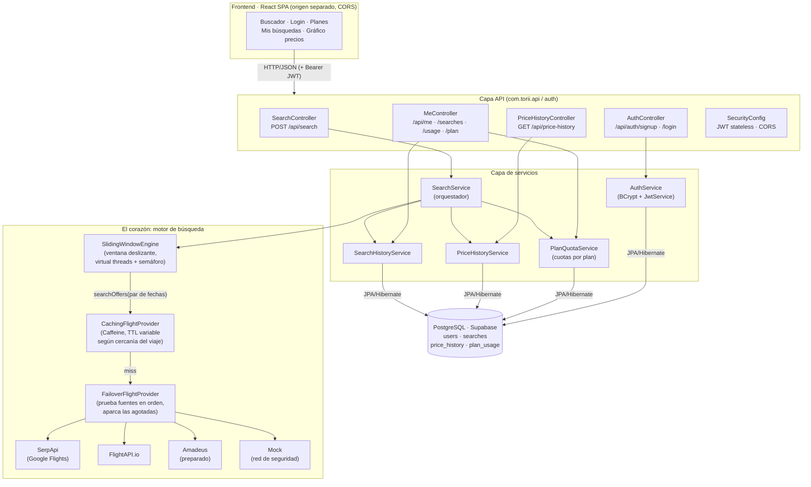
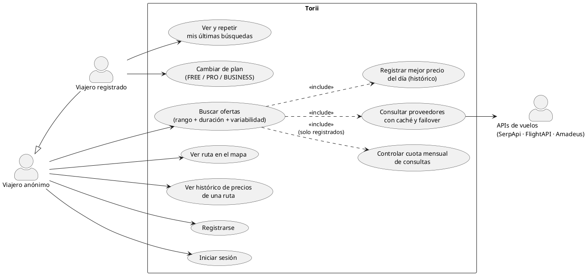
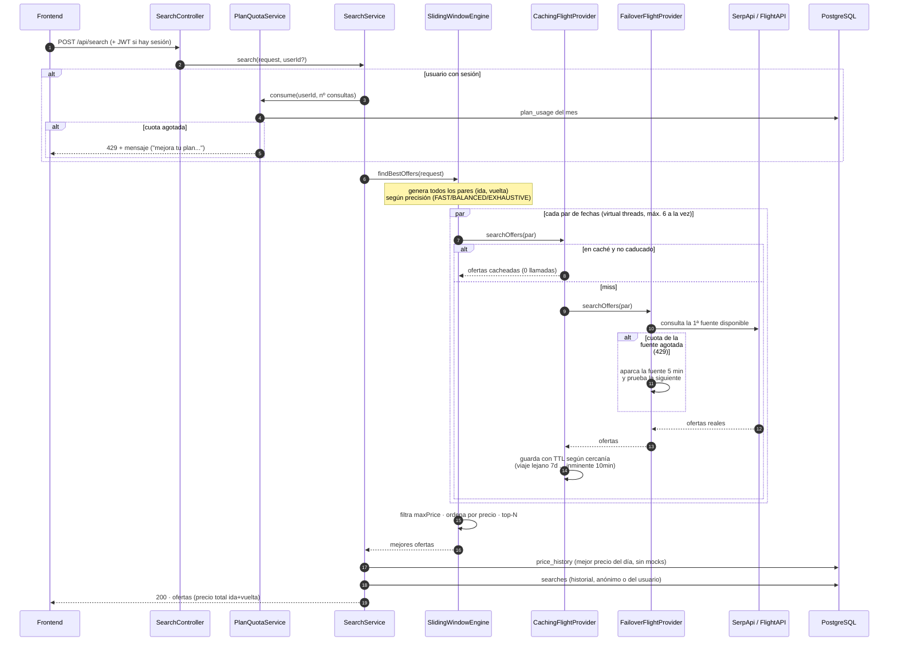
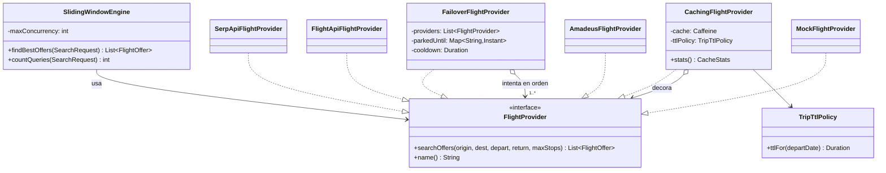
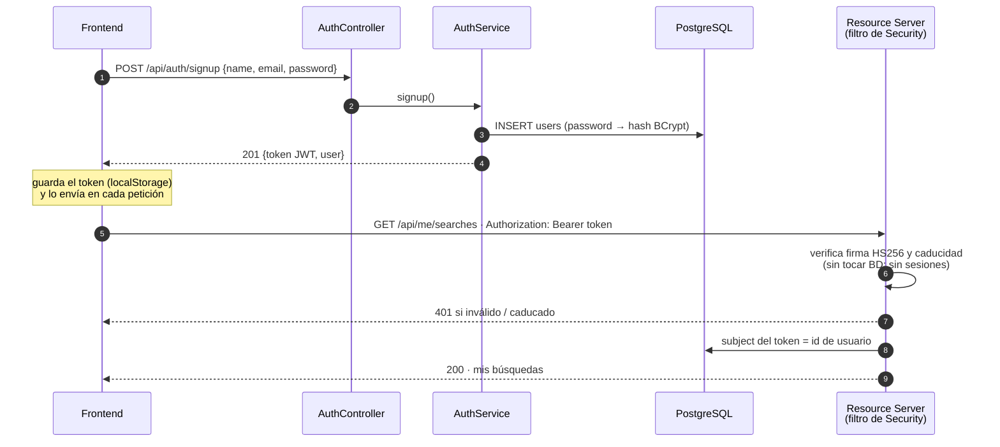
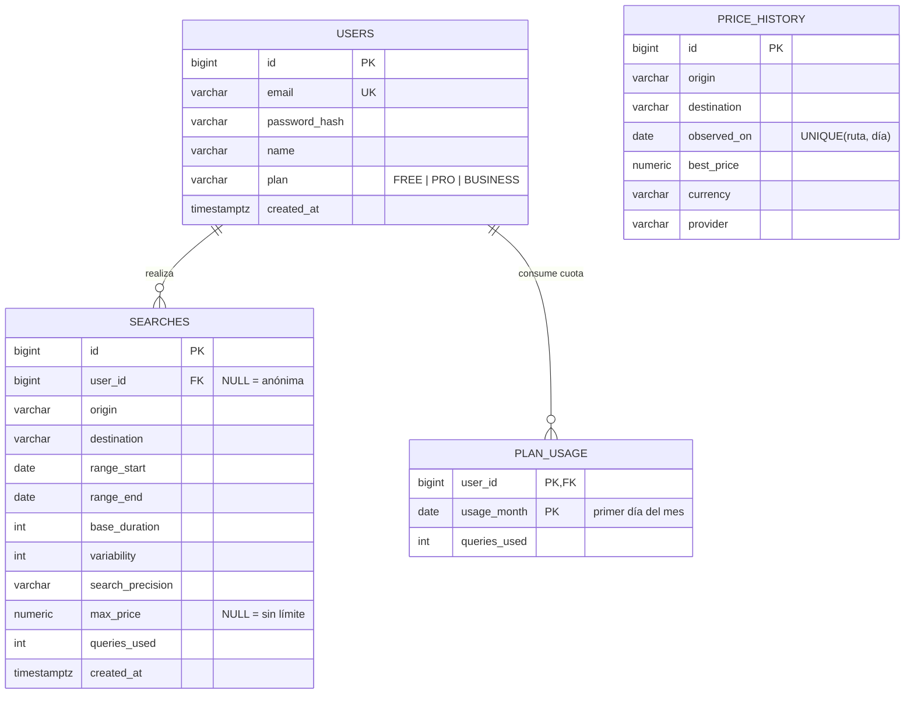

# Arquitectura de Torii

> **Fase 0 completada** — buscador de ofertas de vuelo con múltiples fuentes de datos,
> caché inteligente, usuarios con planes y cuotas, e histórico de precios persistente.
>
> Los diagramas Mermaid se renderizan automáticamente en GitHub. El diagrama de casos
> de uso está en PlantUML (pégalo en [plantuml.com](https://www.plantuml.com/plantuml) o
> [planttext.com](https://www.planttext.com)).

## 1. ¿Qué hace Torii?

El usuario no busca un vuelo con fechas fijas: da un **rango de vacaciones** (ej. julio–septiembre),
una **duración base** (ej. 14 días) y una **variabilidad** (ej. +3 → estancias de 14 a 17 días).
Torii explora todas las combinaciones de fechas con un **algoritmo de ventana deslizante**
y devuelve el top-N de ofertas más baratas (precio total de ida y vuelta).

El problema central del diseño: cada combinación de fechas es una llamada a una API de pago
con cuota limitada. Toda la arquitectura gira alrededor de **minimizar y proteger esas llamadas**:
caché con TTL variable, failover entre proveedores, precisiones de búsqueda y cuotas por plan.

**Stack:** Java 21 + Spring Boot 4 (API REST) · PostgreSQL en Supabase (Flyway + JPA) ·
Spring Security + JWT · React + TypeScript + Tailwind/Untitled UI (SPA separada).

## 2. Vista de componentes



La clave: el motor **no sabe de dónde salen los datos**. `SlidingWindowEngine` habla con la
interfaz `FlightProvider`, y detrás de ella se apilan la caché, el failover y las fuentes
reales sin que el algoritmo cambie una línea.

## 3. Casos de uso (PlantUML)



## 4. El corazón: qué pasa en una búsqueda



Detalles que importan:

- **Paralelismo con hilos virtuales**: los pares de fechas se consultan en paralelo
  (Java 21 virtual threads) con un semáforo global (`torii.search.max-concurrency`) para
  no reventar el rate limit de las APIs. El orden final es determinista (precio → fecha →
  aerolínea) aunque las respuestas lleguen desordenadas.
- **La cuota se cobra ANTES de trabajar**: si no queda saldo, se rechaza sin gastar ni una
  llamada externa.
- **Los registros en BD son "best effort"**: si la BD fallara, la búsqueda responde igual
  (try/catch en el orquestador). La cuota NO: esa es regla de negocio.
- **maxPrice se filtra en cliente del motor**, nunca viaja a las APIs: así la caché sirve
  para cualquier presupuesto.

## 5. Diagrama de clases del motor (patrones Decorador + Composite)



La composición real (montada en `ProviderConfig`):

```
Engine → Caché( Failover( [SerpApi, FlightAPI, Amadeus*, Mock] ) )
```

- **Decorador**: `CachingFlightProvider` envuelve a otro provider y añade caché sin que
  nadie más lo sepa. La caché vive a nivel de *par de fechas*, así búsquedas solapadas
  reutilizan cientos de pares.
- **Composite/Chain**: `FailoverFlightProvider` es un provider hecho de providers: prueba
  en orden, y si una fuente agota cuota (excepción `ProviderQuotaExceededException`) la
  aparca con cooldown y sigue con la siguiente. El `Mock` va siempre último: nunca falla,
  la app siempre responde.
- **Añadir una fuente nueva = una clase + un bean.** Cero cambios en el algoritmo.

## 6. Autenticación (JWT sin estado)



- Contraseñas: solo se guarda el **hash BCrypt** (lento y con sal, irreversible).
- El token es **stateless**: el backend no guarda sesiones; la firma (secreto
  `TORII_JWT_SECRET`) es la única verdad. Caduca a las 24 h.
- Buscar es **público**: con token, la búsqueda se asocia al usuario; sin él, es anónima.
  Solo `/api/me/**` exige autenticación.

## 7. Modelo de datos



- El esquema lo gobiernan **migraciones Flyway** versionadas en git (`db/migration`);
  Hibernate solo valida (`ddl-auto=validate`). Los tests corren las mismas migraciones
  sobre H2 en memoria: sin red y validando el esquema real.
- `price_history` se **alimenta solo**: cada búsqueda real registra (o mejora) el mejor
  precio del día de su ruta — el gráfico del frontend crece gratis con el uso. Las ofertas
  del Mock se excluyen para no contaminar datos reales.

## 8. Reglas de negocio: planes y cuotas

| Plan | Consultas/mes | Nota |
|---|---|---|
| FREE | 30 | plan inicial de toda cuenta |
| PRO | 500 | |
| BUSINESS | ilimitado | |

Una **búsqueda** consume N **consultas** (una por par de fechas explorado; depende del
rango, la variabilidad y la precisión). El frontend estima N en vivo antes de buscar;
el backend calcula el número exacto (`SlidingWindowEngine.countQueries`) y lo descuenta
en `plan_usage`. Sin saldo → `429` con mensaje accionable.

## 9. Decisiones de arquitectura (resumen)

| Decisión | Por qué |
|---|---|
| Monolito modular (no microservicios) | Un solo deploy y transacciones simples; los paquetes (`provider`, `algorithm`, `history`, `auth`, `user`) marcan las costuras por si algún día hay que partirlo |
| Interfaz `FlightProvider` como frontera | El algoritmo no depende de ninguna API concreta; mock-first desde el día 1 |
| Caché por par de fechas con TTL variable | Un viaje a 6 meses vista no cambia de precio cada hora (TTL 7 días); uno inminente sí (TTL 10 min) |
| PostgreSQL (Supabase) + Flyway | Datos relacionales de libro; esquema versionado y reproducible |
| JWT stateless + BCrypt | Sin estado de sesión en el servidor; escala horizontal trivial |
| Frontend y backend en orígenes separados | SPA desplegable en CDN; CORS explícito por entorno |

## 10. Roadmap

- **Hecho (fase 0):** motor + caché + failover multi-fuente + UI completa + BD +
  usuarios/planes/cuotas + histórico de precios.
- **Siguiente:** despliegue real (SPA en Vercel/Netlify, backend dockerizado), alertas de
  bajada de precio, endpoint "calendario de precios" (convertir ~300 llamadas en 1),
  límite por IP para anónimos, pasarela de pago para los planes.
